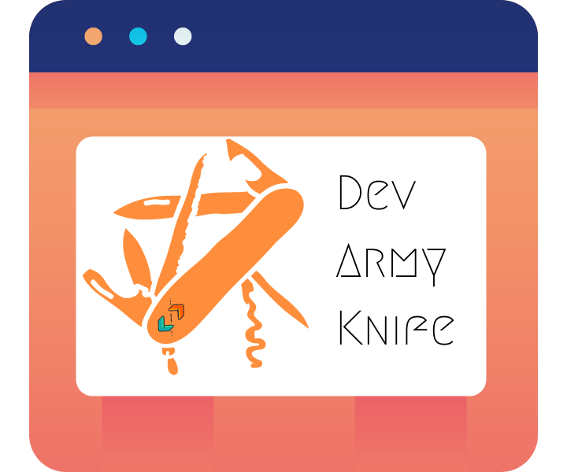

# Dev Army Knife :rocket:

Introducing the Dev Army Knife, a toolkit for developers to do various tasks. Whether it may be generating a QR code, editing a few lines of code without the editor or joining two words without any delays and with high-quality, the Dev Army Knife is here to help you. Inspired by the Swiss Army Knife, this handy toolkit includes many useful tools for developers to use in day-to-day tasks.

## Getting Started
Just log over [here](https://devarmyknife.hackersreboot.tech/). There you will find two options.
1. Go to Tools
2. DevTools Wiki

### Tools  
There are various tools provided to you to use. All of these tools do all the processing on the client side, so I or anyone don't have any data nor for processing nor anything.
[!ref Tools](https://devarmyknife.hackersreboot.tech/explore)

### DevTools Wiki
It has a brief overview of many commonly used tools and frameworks. It provides you with an overview and then gives you a URL to the project page or where to learn it, all with a minimal interface.
[!ref DevTools Wiki](https://devarmyknife.hackersreboot.tech/toolsWiki)

## Features

### :man_in_business_suit_levitating: Tailored
Dev Army Knife is a tool made by a developer (high school student :wink:) for developers. So, it has been tailored to developers (atleast me lol).

### :dark_sunglasses: Dark Mode
The whole app is in Dark Mode. Like, who even use Light Mode nowadays anyway. 

### :zap: Fast
Almost all of the app is rendered Statically (except the Wiki). Also, all the tools are client side, so no sending requests or server overloading etc. Also, our friends over at Netlify are known for being fast.

### :iphone: Mobile Friendly
The Application is designed to be very mobile friendly. This goes a long way in maintaining usability across devices. Especially with things like Code Editors.

### :computer: Self Hostable
You can host the web app yourself, if you don't trust me or my providers. (But, seriously, why would you not).

### :closed_lock_with_key: Secure
The app is very secure since literally no data is stored with us or a big corporation. Yes, no trackers, no ads, no data harvesting.

## Support
You can send me an email over at [arpan@hackersreboot.tech](mailto:arpan@hackersreboot.tech). You can also try to tag me on one of my socials.

## Socials
- [Twitter](https://twitter.com/HackersReboot)
- [GitHub](https://github.com/Arpan-206)
- [Hashnode](https://hashnode.com/@Aero)
- [My Website](https://hackersreboot.tech/)
- [Linkedin](https://www.linkedin.com/in/arpan-pandey/)